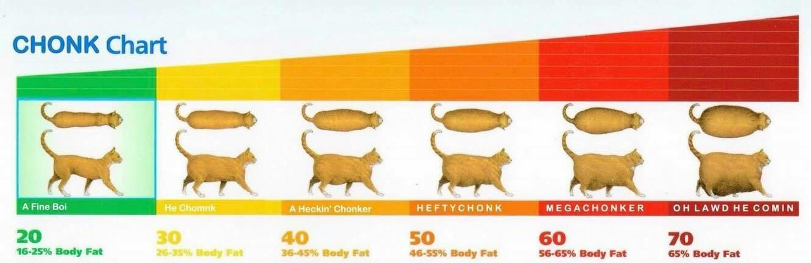

# About
This vite plugin will stop your js chunks from becoming too big

## FAQ
### What is the Bootstrap Chunk?
It's the chunk that's loaded at the very beginning. If you do code splitting properly then page specific code should not be in here. Usually the bootstrap chunk will contain UI theme, fe analytics, app router, etc content

### Why Should we enforce size limit on the bootstrap chunk?
The size of this chunk has an impact of your page app's page load performance. Especially because it's the first js chunk to get fetched by the browser when a user visits your site. 

# Usage
Add the following code in the plugins array of your vite config file.
[See vite plugin docs](https://v2.vitejs.dev/guide/api-plugin.html#plugins-config)

```typescript
  enforceBootstrapBundleSize({
    bootstrapChunkName: 'bootstrap',
    maxBootstrapChunkSizeKb: 2000,
    additionalInstructionsMsg: 'Please consult slack channel #team-xyz if you need help' 
  })
```

### Configuration
1. `bootstrapChunkName` (optional, defaults to `bootstrap`) Specify name of the bootstrap chunk.
2. `maxBootstrapChunkSizeKb` Bootstrap chunk size threshold
3. `additionalInstructionsMsg` Show additional help text when the threshold is crossed e.g. how to proceed, who to consult 

# Links
1. [NPM](https://www.npmjs.com/package/vite-plugin-anti-chonk)

# Template
This repo is extended from [ryansonshine/typescript-npm-package-template](https://github.com/ryansonshine/typescript-npm-package-template/tree/main#readme)

# Anti Chonk Name Origin


